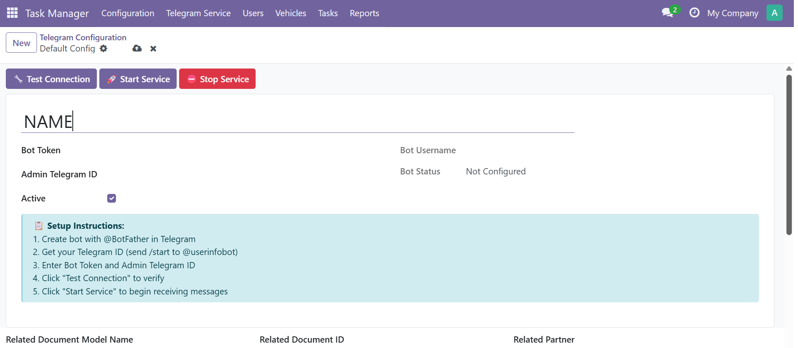
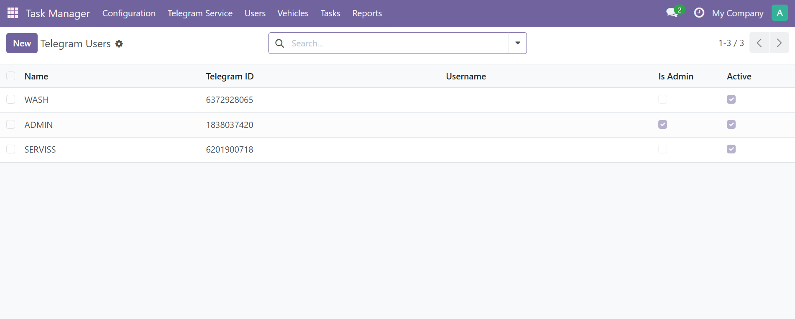
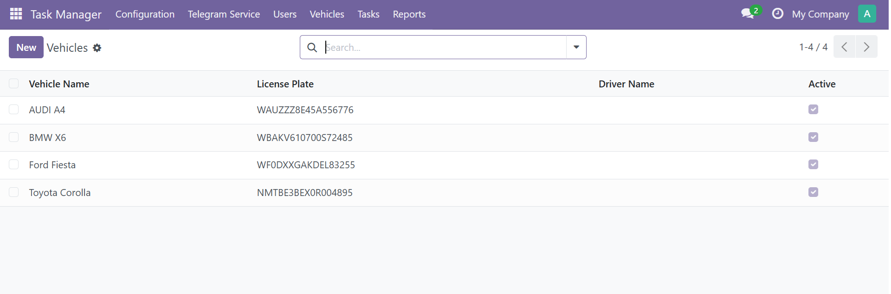
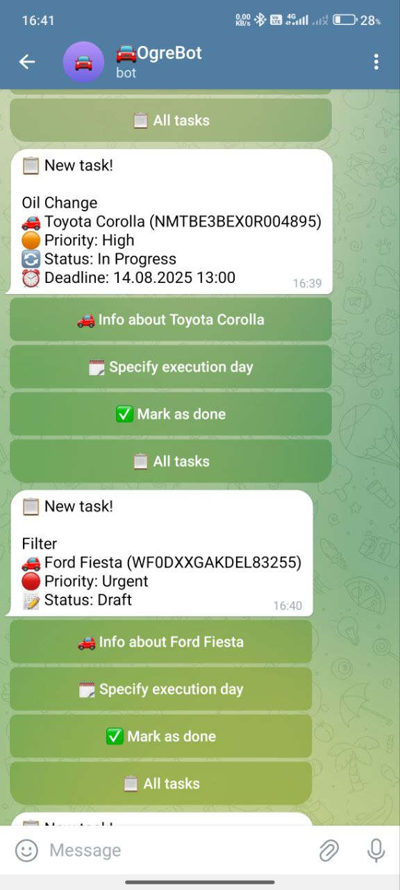
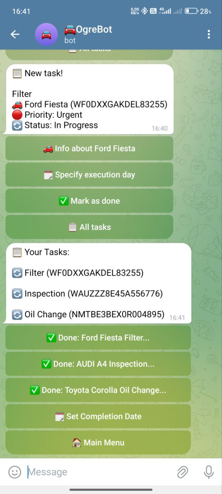
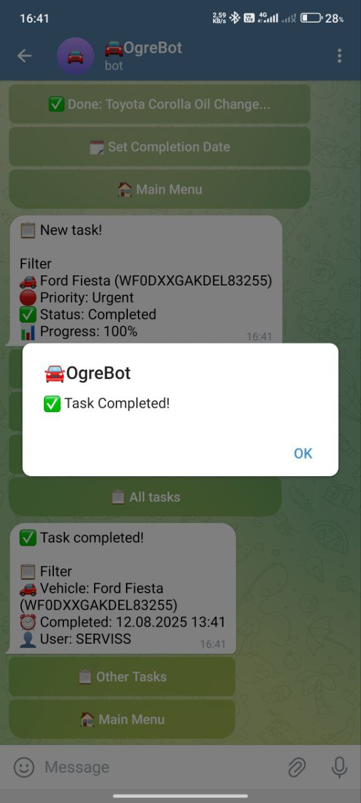
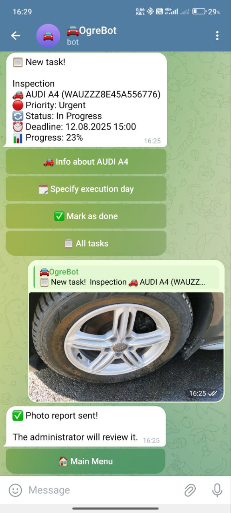

# Odoo Telegram Task Manager

A custom Odoo module that integrates with Telegram to manage tasks directly from the chat interface.  
Users can receive, update, and complete tasks without leaving Telegram, while all task data is synchronized with Odoo.

## Features
- **Telegram Integration** — connect your Odoo to a Telegram bot for instant task communication.
- **Task Assignment** — create and assign tasks directly from Odoo or Telegram.
- **Status Updates** — mark tasks as completed from the Telegram chat.
- **Photo Reports** — send images or documents via Telegram to attach them to tasks.
- **Multi-user Support** — manage tasks for multiple team members in real time.

## Screenshots

### Configuration



### Users and Vehicles



### Tasks




### Reports


## Installation
1. Copy the module folder into your Odoo `addons` directory.
2. Restart the Odoo server:
   ```bash
   python odoo-bin -d <your_database> --addons-path=../addons,addons --dev=all


